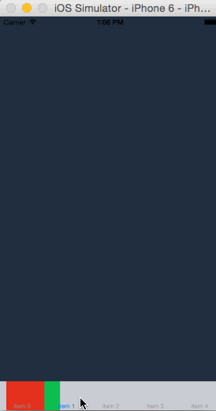
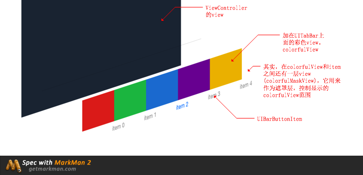

# TColorfulTabBar

彩色的TabBar，加平滑的切换动画(gif图看起来有点掉帧...)

## 设计图


## 效果展示



## 视图层级

这个效果的实现是通过重写TabBar，然后给TabBar添加了一个彩色view(`colorView`)实现的。

视图层级如下：



## 使用

在`UITabBarController`中，将系统的`UITabBar`替换成`TColorfulTabBar`即可。(<font color = red>注：tabBarController.tabbar属性是readonly修饰的，所以要通过KVC来修改</font>)

代码如下：

```objc
TColorfulTabBar *tabBar = [[TColorfulTabBar alloc] initWithFrame:tabBarController.tabBar.frame];
[tabBarController setValue:tabBar forKey:@"tabBar"];
```

## 自定义

Demo相关配置在`TColorfulTabBar+Configuration`这个类目当中，可以修改每个item的颜色与item的个数。

```objc
// item的颜色（个数要和item的个数相同）
- (NSArray *)itemColors;

// item的个数
- (NSInteger)itemCount;
```

## 技术支持

[http://www.saitjr.com/ios/ios-colorful-tabbar-implement.html](http://www.saitjr.com/ios/ios-colorful-tabbar-implement.html)

## 可能出现的问题

因为当`TColorfulTabBar`加载到父视图上时，我让`TColorfulTabBar`响应了自己的代理方法，所以如果在`UITabBarController `中再次修改`delegate `，可能会导致`TColorfulTabBar`无法拿到下标。

如果没有修改代理，那有可能会导致`UITabBarController`中的`UITabBarDelegate`无效。

## Swift版本

broccolii实现了Swift版本：[https://github.com/broccolii/ColorFulTabBar/tree/master](https://github.com/broccolii/ColorFulTabBar/tree/master)
